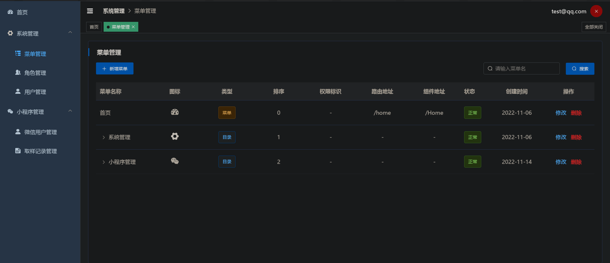

# VGG_Flower

# 部署

## 启动SpringBoot

运行Jar包：

```shell
java -jar target/*.jar
```

## 启动数据库服务

```shell
# 启动MariaDB
sudo systemctl start mysql
sudo mysql 
# 启动Redis
redis-server
```

## 启动AI服务器

```shell
python distinguish.py
//http://127.0.0.1:8086/predict/
```

## 启动前端

```shell
npm install
npm run serve
```

# 演示


## 前端管理界面



# 项目结构

## 前端

### AdminUI

要求：Node版本<=16：node v17中的OpenSSL3.0对允许算法和密钥大小增加了严格的限制
